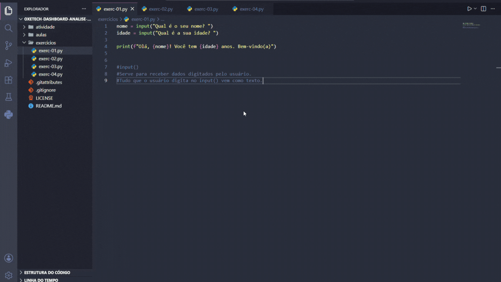

# Dashboard e Análise de Dados - Oxetech

Repositório criado para armazenar exercícios, materiais e projetos desenvolvidos durante as aulas de Dashboard e Análise de Dados no Oxetech.

---

## 📚 Conteúdo

- Exercícios em Python
- PDFs de exercícios
- PDFs das Aulas
- Projetos desenvolvidos ao longo do curso
- Gifs das Atividades e Exercícios
  
---

## 🛠️ Tecnologias utilizadas

- Python
- Git
- GitHub
- Markdown


---
## 📚 Exercícios das aulas



---

## 🏠 Atividades de Casa


---

## 📂 Estrutura do Projeto

```
OXETECH-DASHBOARD-ANALISE-DADOS/
│
├── atividade/
│   └── atividade_de_casa/
│       ├── atividade_1.py
│       ├── atividade_2.py
│       ├── atividade_3.py
│       ├── atividade_4.py
│       └── Primeira lista de exercícios - Dashboards e Análise de Dados.pdf
│
├── aulas/
│   ├── datasets/
│   │   └── .gitkeep
│   │
│   └── pdf/
│       └── Dashboards e Análise de Dados.pdf
│
├── exercicios/
│   ├── exerc-01.py
│   ├── exerc-02.py
│   ├── exerc-03.py
│   └── exerc-04.py
│
├── imagens/
│   ├── atividades.gif
│   └── exercícios.gif
│
├── .gitattributes
├── .gitignore
├── LICENSE
└── README.md
```

---

## 🚀 Objetivos do repositório

* Praticar Python
* Aprender análise de dados
* Desenvolvimento de dashboards
* Melhorar organização de projetos
* Praticar Git e GitHub
* Praticar Markdown
* Construir Portfólio
  
---

## 📈 Futuras implementações

* Dashboards interativos
* Análises exploratórias
* Visualização de dados
* Projetos completos com datasets reais

---

## 👨‍💻 Autor

Desenvolvido por Samuel Berto durante os estudos de Dashboard e Análise de Dados no Oxetech.


